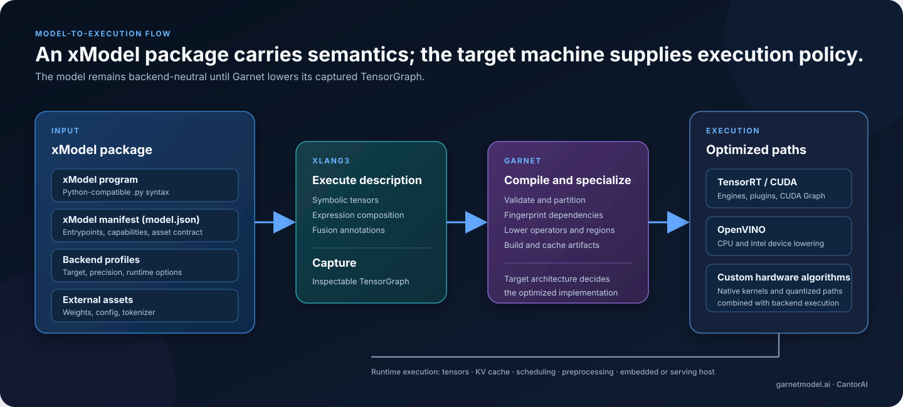

# Garnet

**Garnet is a programmable AI inference runtime that compiles xModel packages
into backend- and hardware-specialized execution.**

**xModel** is Garnet's backend-neutral model programming format and package
contract. An xModel package contains one or more XLang3 Tensor Expression
programs in `.py` files, an xModel manifest, backend profiles, and contracts for
external assets. Its source uses Python-compatible syntax, but it is not an
ordinary CPython/PyTorch model. Garnet captures its expressions as an
inspectable computation graph, partitions and lowers the graph, and compiles
it through TensorRT, OpenVINO, native CPU execution, or custom hardware
algorithms and kernels for the target processor architecture.

This is a compiler/runtime approach to inference. Serving APIs can be built on
top of Garnet, but serving is not Garnet's architectural identity.

**Website:** [https://www.garnetmodel.ai/](https://www.garnetmodel.ai/)

[Getting started](docs/getting-started.md) · [Architecture diagram](docs/images/garnet-programmable-runtime.svg) · [xModel programs](xModel/README.md) · [Capture coverage](test/xlang3/models/production-capture.md) · [Benchmarks](docs/qwen3-1.7b-performance.md)


## Why Garnet?

Most inference systems start with a model implemented in an existing eager
framework and concentrate their optimization effort in a serving engine around
it. That is an effective design for many datacenter workloads, especially when
high aggregate throughput and mature distributed serving are the priorities.

Garnet starts one level earlier: the model itself is a programmable tensor
computation. Because model structure remains visible to the runtime, Garnet can
specialize graph boundaries, operators, memory behavior, precision, KV-cache
execution, kernels, and compiled artifacts for a concrete backend and machine.

That design is aimed at workloads where execution control and end-to-end
latency matter:

- interactive and batch-1 LLM inference;
- VLM pipelines with image preprocessing close to model execution;
- speech recognition and synthesis;
- robotics, Physical AI, and real-time perception/reasoning;
- native applications that embed inference in-process.

Garnet does not claim to be universally faster than vLLM, SGLang,
TensorRT-LLM, or PyTorch. It explores a different programming and optimization
boundary.

## xModel: Models Are Programs

An xModel package separates model semantics from backend policy:

- XLang3 `.py` source uses Python-compatible syntax to describe the
  computation;
- Tensor Expressions represent symbolic tensor operations;
- the xModel manifest (`model.json`) declares entry points, capabilities,
  profiles, and external assets;
- backend profiles select targets such as TensorRT/CUDA BF16 or OpenVINO;
- checkpoint weights and tokenizers remain external to this source tree.

The `.py` model is not treated as an opaque CPython application and is not
replayed for every inference call. XLang3 executes the model description with
symbolic tensors. Garnet captures the resulting operations, dependencies,
attributes, fusion regions, and structured outputs as a graph. The captured
DAG is then replayed into a backend-neutral lowering interface; the Python
forward function is not called again during backend replay.



Backend selection belongs to profiles and runtime configuration, not to the
xModel program. The same model semantics can therefore be inspected and
lowered without importing a concrete accelerator API into the xModel source.

These execution paths are not necessarily exclusive. Garnet can lower standard
graph regions to TensorRT, OpenVINO, or native CPU execution while implementing
architecture-sensitive operations—such as paged attention, KV-cache updates,
sampling, image preprocessing, or quantized matrix multiplication—with custom
plugins and kernels. This keeps hardware specialization below the xModel
boundary.

## Tensor Expression

Tensor Expression is the boundary between readable model code and compilable
model computation. The following is abridged from the actual
[Qwen3-1.7B program](xModel/qwen3/text_1_7b/prefill.py):

```python
import garnet

T = garnet.tensor()

from . import qwen_llm as llm

@T.fusion(role="decoder_layer", atomic=True)
def layer(x, position_ids, attention_mask, key_pages, value_pages,
          page_table, start_position, config, layer_idx):
    prefix = "model.layers." + str(layer_idx)
    residual = x
    normalized = llm.rms_norm(
        x, prefix + ".input_layernorm.weight", config["rms_norm_eps"])
    x = residual + attention(
        normalized, position_ids, attention_mask, key_pages, value_pages,
        page_table, start_position, config, layer_idx)
    residual = x
    normalized = llm.rms_norm(
        x, prefix + ".post_attention_layernorm.weight",
        config["rms_norm_eps"])
    return residual + llm.mlp(normalized, config, layer_idx)

@T.fusion(
    name="qwen3_1_7b_prefill",
    role="transformer_prefill",
    boundary="required",
)
def Qwen3Prefill(input_ids, position_ids, attention_mask, key_pages,
                 value_pages, page_table, start_position, weights, config):
    x = input_ids * T.unary_op(
        "embedding",
        weight_name="model.embed_tokens.weight",
    )
    for layer_idx in range(config["num_hidden_layers"]):
        x = layer(
            x, position_ids, attention_mask, key_pages, value_pages,
            page_table, start_position, config, layer_idx,
        )
    return llm.finish(x, config)
```

In this API, an expression such as `x * T.unary_op(...)` is composition, not
eager scalar multiplication. The operator factory is lazy. During capture,
Garnet retains the operator name, operands, attributes, dependencies, and the
surrounding fusion regions. A backend later lowers that graph to real
execution; an unsupported operation fails compilation instead of silently
falling back to a fake result.

See the compact [graph capture test](test/xlang3/tensor_graph.py) for a complete
example with symbolic inputs, nested fusion regions, structured outputs,
partitioning, and independent CPU expressions.

## XLang3 and Garnet

Ordinary Python is an excellent orchestration language, but model execution in
CPython is commonly opaque to a native compiler unless another framework first
traces or exports it. XLang3 supplies the language/runtime boundary that lets
Garnet express Tensor Expression programs with Python-compatible syntax while
making their computation directly available for graph capture.

The responsibilities are deliberately separated:

```text
XLang3                         Garnet
---------------------------    ----------------------------------------
Executes xModel `.py` source   Defines AI tensor operators and model
written in Python-compatible   package contracts
syntax

Provides symbolic tensors      Captures and validates model graphs
and graph infrastructure

Hosts native packages          Partitions, lowers, compiles, caches,
and values                     and executes backend-specific artifacts
```

This keeps model authors in readable source code while preserving a native,
inspectable computation that Garnet can specialize.

## xModel Programs

The repository currently contains 27 xModel programs across these model
families:

| Modality | Included xModel family | Entry points represented |
| --- | --- | --- |
| LLM | Qwen3-1.7B | prefill, decode, batch decode |
| VLM | Qwen3-VL-2B-Instruct | vision, multimodal prefill, text prefill/decode |
| ASR | Qwen3-ASR-0.6B | prefill, decode |
| TTS | Qwen3-TTS-12Hz 0.6B and 1.7B CustomVoice | talker, code predictor, codec decode |

All 27 modules import under XLang3, and the production capture suite captures
19 entry points at one- and two-layer symbolic profiles. This proves source and
graph-capture coverage; it does **not** by itself prove full checkpoint
inference, numerical parity, or complete lowering on every backend. Exact
coverage and known operator gaps are recorded in
[production capture coverage](test/xlang3/models/production-capture.md).

## Getting Started

The [Getting Started guide](docs/getting-started.md) covers prerequisites,
building Garnet and XLang3, graph-capture validation, the weight-free backend
smoke test, Qwen3-1.7B inference, and the xModel development workflow.

## Writing a Model

1. Create an XLang3 `.py` model using Python-compatible syntax, symbolic
   inputs, and Garnet Tensor Expressions.
2. Use `@T.fusion(...)` to describe meaningful or required graph boundaries.
3. Add a `model.json` manifest that identifies callable entry points and
   external assets.
4. Add backend profiles separately from the xModel source.
5. Capture the program first; then validate lowering and numerics on each
   intended backend with real weights.

The [xModel guide](xModel/README.md) and
[Qwen3-1.7B xModel manifest](xModel/qwen3/text_1_7b/model.json) show the current
package layout. The runtime fingerprints the captured program and its
dependencies so compiled engines can be reused while source changes invalidate
stale artifacts.

## Runtime and Backends

Garnet currently contains:

- backend-neutral TensorGraph capture and replay;
- TensorRT/CUDA graph lowering and hardware-specific engine compilation;
- OpenVINO lowering for the implemented operator subset;
- custom TensorRT plugins and CUDA kernels for architecture-sensitive
  operations;
- native CPU INT4/Q4Q8 algorithms for selected text operations;
- paged KV-cache management and continuous-decode graph support;
- native image and audio preprocessing used by model frontends;
- engine fingerprinting, caching, reload, and concurrent instance reuse.

Backend coverage is not identical. TensorRT has static dispatch coverage for
all 54 Garnet operators reached by the 19 captured production roots, although
static dispatch presence is not numerical proof. OpenVINO currently lacks a
number of VLM, ASR, TTS, and paged-KV operators. Consult the capture coverage
document before selecting a backend for a model family.

## Performance

These are repository-documented baselines, not cross-framework victory claims.
Initial TensorRT compilation is excluded from warm execution and cached for
subsequent runs.

### Qwen3-1.7B text, TensorRT

Hardware: NVIDIA RTX 4080; official BF16 `Qwen/Qwen3-1.7B` checkpoint.

| Graph | Batch | Average step | p95 step | Aggregate throughput |
| --- | ---: | ---: | ---: | ---: |
| Four-token prefill | 1 | 8.985 ms | — | — |
| Single decode | 1 | 7.787 ms | 7.960 ms | 128.41 tokens/s |
| Masked continuous decode | 4 | 7.577 ms | 8.822 ms | 527.90 tokens/s |

A cached, one-call prompt with 18 input tokens generated 12 tokens in 92.79 ms
at 137.25 decode tokens/s. Initial optimization took approximately 4.7–4.8
minutes per static shape on that machine. Full methodology and implemented
paths are in the [Qwen3-1.7B baseline](docs/qwen3-1.7b-performance.md).

### Qwen3-VL-2B, TensorRT

Hardware: NVIDIA RTX 4080; BF16; Windows; TensorRT optimization level 5.

| Path | Batch | Average step | p95 step | Aggregate throughput |
| --- | ---: | ---: | ---: | ---: |
| Paged decode | 1 | 7.72 ms | 8.42 ms | about 129.5 tokens/s |
| Masked continuous-decode graph | 4 | 6.86 ms | 7.09 ms | 582.87 tokens/s |

The real-image path used 240 native vision patches, 60 merged visual tokens,
77 prompt tokens, and 10 output tokens; warm requests measured approximately
87–91 ms. These measurements establish the compiled graph and real-image
pipeline, not a completed asynchronous HTTP serving stack. See the
[VLM performance baseline](docs/qwen-vl-implementation/performance-baseline.md).

## Garnet and Serving Frameworks

vLLM and SGLang primarily provide mature serving systems: request scheduling,
high-throughput batching, distributed deployment, and user-facing server APIs.
Garnet focuses on the programmable model computation beneath such a layer.

```text
Serving-centric system                 Garnet
-------------------------------        -------------------------------
Model in an existing framework         Model as an XLang3 tensor program
             |                                      |
             v                                      v
Serving engine and scheduler           capture / partition / lower
             |                                      |
             v                                      v
Framework/backend execution            specialized native execution
```

A product may expose Garnet through an HTTP or OpenAI-compatible adapter, but
that adapter is a consumer of the runtime. Garnet is currently less mature than
established serving systems in distributed and asynchronous server features;
its differentiator is control of the model-to-backend compilation path.

## Project Status

Garnet is under active development.

- **Verified:** native graph capture; fusion and partition metadata; real
  compilation/execution of small models on TensorRT and OpenVINO; documented
  Qwen3-1.7B text and Qwen3-VL TensorRT inference paths; engine cache reload;
  concurrent model instances sharing a compiled engine.
- **Backend-dependent:** full model operator coverage, numerical validation,
  quantization paths, and supported devices.
- **In progress:** broader OpenVINO operator coverage, additional end-to-end
  ASR/TTS validation, richer quantization, and production serving integration.
- **Not bundled:** model checkpoints, tokenizers, CUDA, TensorRT, OpenVINO, and
  third-party media. Their own licenses and terms apply.

Do not infer full model support from successful graph capture alone. Tests and
documentation intentionally distinguish source import, capture, lowering,
backend execution, pretrained inference, and performance validation.

## Roadmap

- Expand backend lowering coverage while keeping xModel programs backend-neutral.
- Validate complete ASR and TTS paths with reproducible assets and metrics.
- Extend native quantization and architecture-specific kernel specialization.
- Improve compilation diagnostics, graph inspection, and profiling tools.
- Harden reusable runtime interfaces for embedded and serving hosts.
- Extend validation beyond the current documented Windows environment.

## Contributing

Issues and focused pull requests are welcome. Changes to xModel programs should
include capture tests; backend work should include explicit unsupported-op
behavior, numerical checks, and reproducible performance methodology where
applicable. Please avoid adding model weights, licensed datasets, credentials,
or machine-specific build artifacts to the repository.

## License

Copyright 2024-2026 CantorAI Inc.

Garnet source code authored by CantorAI is licensed under the Apache License,
Version 2.0. See [LICENSE](LICENSE) and [NOTICE](NOTICE). Bundled third-party
source retains the license and notices identified in `NOTICE` and in the
respective source files.

Model weights, tokenizers, test media, accelerator SDKs, and other third-party
artifacts retain their respective licenses and are not relicensed by Garnet.

## About CantorAI

Garnet is developed by **CantorAI Inc.** as an open-source foundation for
programmable, hardware-specialized AI inference. XLang3 provides the underlying
open-source language and runtime technology; Garnet builds the tensor-program,
model-runtime, and backend compilation layers on top of it.

Learn more at [garnetmodel.ai](https://www.garnetmodel.ai/).
