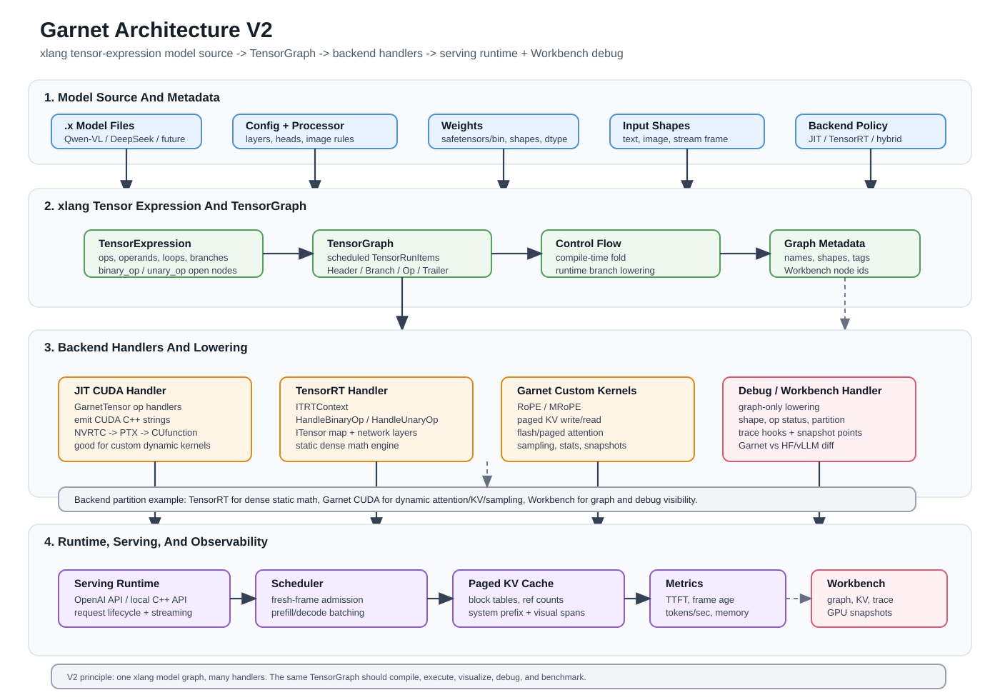

# Garnet Architecture V2

## Purpose

Garnet V2 is a cross-platform VLM/LLM serving and compilation runtime.

The core idea is:

```text
model is written once as xlang tensor expression
  -> TensorExpression captures ops and control flow
  -> TensorGraph schedules the graph
  -> backend handlers lower the graph to JIT CUDA, TensorRT, custom kernels, or debug/workbench traces
```

Qwen3-VL is the first serious target, but the architecture is model-agnostic.

## Architecture Diagram



## Layer Overview

### 1. Model Source Layer

Model architecture is described in `.x` files:

```text
qwen_vl/xmodel/qwen_vl_model.x
qwen_vl/xmodel/vision_encoder.x
qwen_vl/xmodel/vl_adapter.x
qwen_vl/xmodel/qwen_llm.x
```

These files should express the real model forward path:

- vision encoder
- visual-language adapter
- text embedding
- visual/text merge
- decoder blocks
- attention
- MLP
- logits

The `.x` model file is not only documentation. It is the source program Garnet compiles.

### 2. Metadata Layer

The xlang model expression is combined with:

- `config.json`
- tokenizer and processor metadata
- safetensors/bin weight index
- runtime input shapes
- backend selection

This metadata fills layer counts, hidden sizes, head counts, visual token rules, weight shapes, dtype, and execution policy.

### 3. Tensor Expression Layer

The xlang host records tensor expressions instead of immediately executing model ops.

Example:

```python
output = a * T.binary_op("trt_matmul") * weights["W"]
```

This becomes a tensor-expression node:

```text
binary_op("trt_matmul", a, weights["W"])
```

Loops and branches are also part of the model program:

```python
for i in range(config.num_hidden_layers):
    hidden = decoder_layer(hidden, weights, i)

if config.use_moe:
    hidden = moe_layer(hidden)
else:
    hidden = dense_mlp(hidden)
```

Compile-time branches should be folded during graph build. Runtime branches must be preserved or lowered to custom backend ops.

### 4. TensorGraph Layer

`TensorGraph` turns the expression tree into scheduled graph items:

- tensor ops
- structural ops
- `Header`
- `Trailer`
- `BranchBegin`
- `BranchEnd`
- tensor cache entries
- generated code fragments

This is the common IR-like layer for backend lowering.

### 5. Backend Handler Layer

The same TensorGraph can be interpreted by different handlers.

#### JIT CUDA Handler

The original Garnet path:

```text
TensorGraph
  -> GarnetTensor op handlers
  -> CUDA C++ code string
  -> NVRTC
  -> PTX / CUmodule / CUfunction
  -> kernel launch
```

#### TensorRT Handler

The TensorRT branch introduces an open-op lowering path:

```text
T.binary_op("trt_matmul")
  -> GarnetTensor::BinaryOp
  -> ITRTContext::HandleBinaryOp
  -> TRTBuilder
  -> TensorRT network layer / plugin / engine
```

This keeps the frontend unified while allowing TensorRT-specific lowering.

#### Custom Kernel Handler

Dynamic serving operations can stay in Garnet:

- RoPE / MRoPE
- paged KV write
- paged attention
- FlashAttention integration
- sampling
- cache block copy
- tensor stats/snapshot kernels

#### Debug / Workbench Handler

The Workbench backend can consume the same graph to emit:

- architecture graph
- tensor graph
- backend partition graph
- shapes
- op metadata
- missing-op status
- runtime trace hooks

### 6. Runtime Serving Layer

The serving runtime manages:

- OpenAI-compatible API
- local C++ API
- tokenizer and image/video preprocessing
- request lifecycle
- continuous batching
- fresh-frame scheduling
- prefill/decode scheduling
- paged KV cache
- multimodal cache when reuse exists
- CUDA streams and events
- metrics and tracing

For world-sense VLM serving, the scheduler must support frame freshness:

```text
latest frame is often more valuable than every frame
```

So Garnet should support frame admission, frame dropping, and visual-token budgeting.

### 7. Workbench Layer

Garnet Workbench is a companion web tool.

It should visualize:

- model architecture
- expanded TensorGraph
- backend partitions
- prompt/media layout
- cacheable system prefix
- image-dependent visual span
- KV cache block table
- scheduler state
- tensor stats
- GPU snapshots
- layer-by-layer diff against HF/vLLM

This is important because model adapter bugs are usually hidden inside intermediate tensors.

## Backend Partitioning

For Qwen3-VL, the V2 direction is a hybrid backend:

```text
TensorRT:
  dense static math
  matmul
  MLP
  some norm/projection blocks

Garnet custom CUDA:
  RoPE / MRoPE
  paged KV cache
  flash/paged attention
  sampling
  scheduler-sensitive kernels

Workbench/debug:
  trace
  snapshot
  shape inspection
  backend status
```

This avoids treating TensorRT as a black box while still using it for the parts it does well.

## Open Ops

Open ops allow xlang source to name operations without hardcoding every backend path into the frontend:

```python
x = x * T.binary_op("trt_matmul") * w
x = x * T.unary_op("rms_norm")
x = x * T.unary_op("rope")
```

The backend registry decides:

```text
mapped to TensorRT layer
mapped to TensorRT plugin
mapped to Garnet CUDA kernel
mapped to JIT-generated CUDA
unsupported
debug-only
```

Workbench should show this mapping explicitly.

## Control Flow

Garnet should distinguish:

```text
compile-time control flow:
  config/model architecture decisions
  should be folded during graph construction

runtime control flow:
  depends on request/tensor values
  must be lowered to backend-supported branch, custom op, or scheduler decision
```

Examples:

```text
config says dense model:
  omit MoE graph

config says MoE model:
  include MoE graph

runtime expert routing:
  lower to topk/grouped-gemm/scatter custom ops, not many naive if statements
```

## Debug And Snapshot Path

Debug must be optional and low overhead when disabled.

Modes:

```text
off:
  no debug work

shape:
  tensor name, shape, dtype, device

stats:
  min/max/mean/std/nan/inf via small GPU reduction

sample:
  selected tensor values copied to CPU

snapshot:
  selected full tensor copied to CPU

compare:
  compare with HF/vLLM/reference trace
```

Runtime emits JSONL traces and optional tensor snapshot files. Workbench renders them on top of the graph.

## V2 Build Order

1. Define model graph and debug JSON schemas.
2. Make `.x` model files expose explicit forward functions.
3. Add Workbench static graph viewer for `.x`/metadata.
4. Implement backend mapping status reporting.
5. Complete first `HandleBinaryOp("trt_matmul")` TensorRT lowering.
6. Add runtime trace events from TensorGraph execution.
7. Add KV cache visualization.
8. Add fresh-frame benchmark timeline.
9. Add selected GPU tensor snapshots.
10. Add Garnet vs HF/vLLM layer diff.

## Current Branch Status

Implemented or sketched:

- Qwen VL `.x` model sketches
- TensorRT builder skeleton
- `ITRTContext`
- `HandleBinaryOp`
- `HandleUnaryOp`
- `T.binary_op`
- `T.unary_op`
- TensorRT CMake wiring
- design docs and tests

Incomplete:

- real backend state from `T.set_backend`
- model script convention for forward/build entry point
- TensorRT ITensor mapping
- TensorRT layer creation
- engine wrapper and execution
- paged KV manager
- attention backend
- Workbench graph/trace schema
- GPU snapshot path
