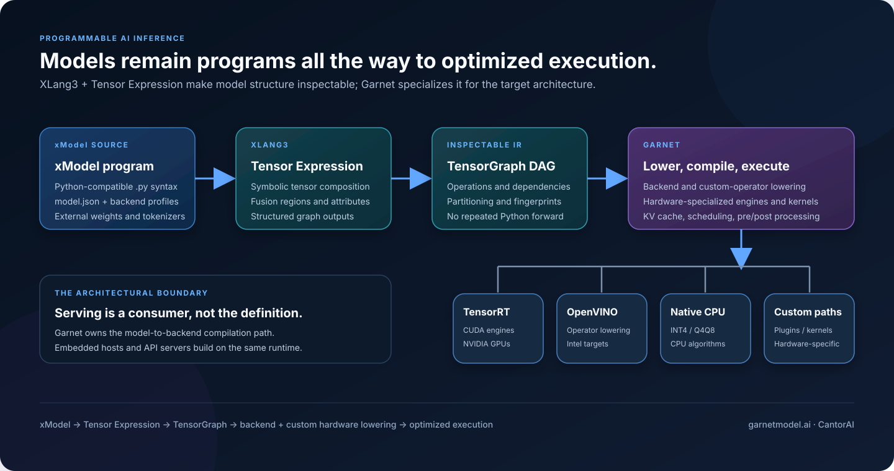

# Garnet Programmable Runtime Architecture

Garnet compiles xModel packages into backend- and hardware-specialized
execution. Model semantics are expressed once as XLang3 Tensor Expression
programs; backend selection and optimization remain separate.



## Architectural Contract

```text
xModel package
  -> XLang3 executes Python-compatible .py source
  -> Tensor Expressions and fusion regions
  -> captured TensorGraph DAG
  -> validation, partitioning, and fingerprinting
  -> backend and custom-operator lowering
  -> compiled, cached execution
```

An xModel package contains:

- one or more XLang3 Tensor Expression programs in `.py` files;
- an xModel manifest (`model.json`);
- backend profiles;
- contracts for external weights, tokenizers, and configuration.

The xModel program describes model computation. It does not select TensorRT,
OpenVINO, CUDA, or a CPU implementation from model source.

## Graph Capture

XLang3 executes xModel source with symbolic tensors. Garnet's lazy unary and
binary operator factories record semantic operation names, operands,
attributes, dependencies, structured outputs, and annotated fusion regions.

The resulting TensorGraph is inspectable and backend-neutral. Garnet replays
the captured DAG into an `ILoweringContext`; backend compilation does not call
the Python forward function again.

Unsupported operators fail backend compilation explicitly. Successful capture
proves graph structure, not lowering coverage or numerical correctness.

## Lowering and Execution

Garnet currently supports four execution categories:

- TensorRT engines and CUDA execution for NVIDIA GPUs;
- OpenVINO lowering for the implemented operator subset;
- native CPU algorithms, including selected INT4/Q4Q8 paths;
- custom hardware-sensitive plugins and kernels.

These categories can be combined. Dense graph regions may lower to a backend
engine while paged attention, KV-cache updates, sampling, preprocessing, or a
quantized matrix multiplication uses a custom implementation.

## Runtime Responsibilities

The runtime owns mechanisms shared across xModel families:

- compiled artifact fingerprinting, caching, and reload;
- tensor bindings and output ownership;
- paged KV-cache allocation and request state;
- scheduler-to-graph execution plans;
- image and audio preprocessing;
- native host interfaces.

Serving adapters are consumers of this runtime. They are not the definition of
Garnet's architecture.

## Source Layout

```text
src/
  core/                  backend-neutral lowering interface
  tensor/                TensorGraph capture and replay bridge
  model/                 xModel loading and compiled runtime
  runtime/               scheduling, KV cache, and executors
  backends/tensorrt/     TensorRT lowering and plugins
  backends/openvino/     OpenVINO lowering
  backends/cpu/          native CPU paths
  cuda/                  custom CUDA operations
  image/                 vision preprocessing
  tokenizer/             native tokenization
  entry/                 public XLang3/native package boundary

xModel/
  qwen3/
    text_1_7b/
    vl_2b_instruct/
    asr_0_6b/
    tts_12hz_0_6b_custom_voice/
    tts_12hz_1_7b_custom_voice/
```

## Validation Boundary

Validation is intentionally layered:

1. source import;
2. TensorGraph capture;
3. backend lowering and engine construction;
4. numerical execution with controlled inputs;
5. pretrained checkpoint inference;
6. reproducible performance measurement.

See [production capture coverage](../test/xlang3/models/production-capture.md)
for the exact current boundary and known backend gaps.
